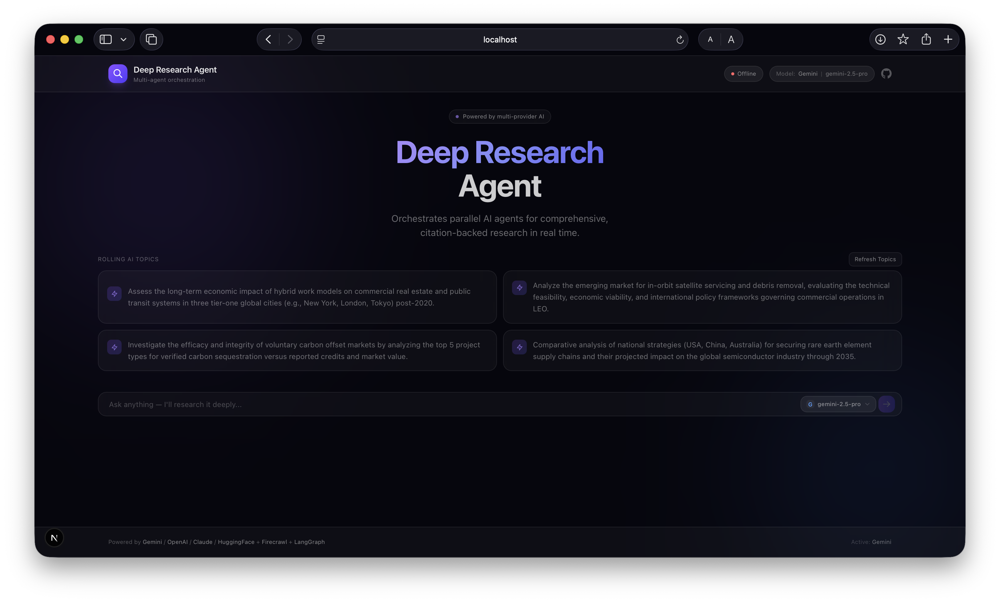
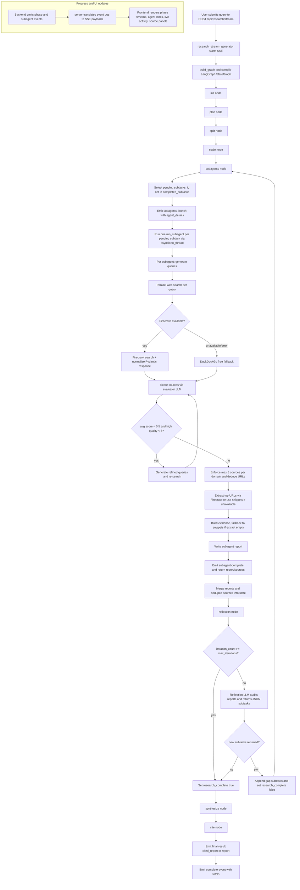
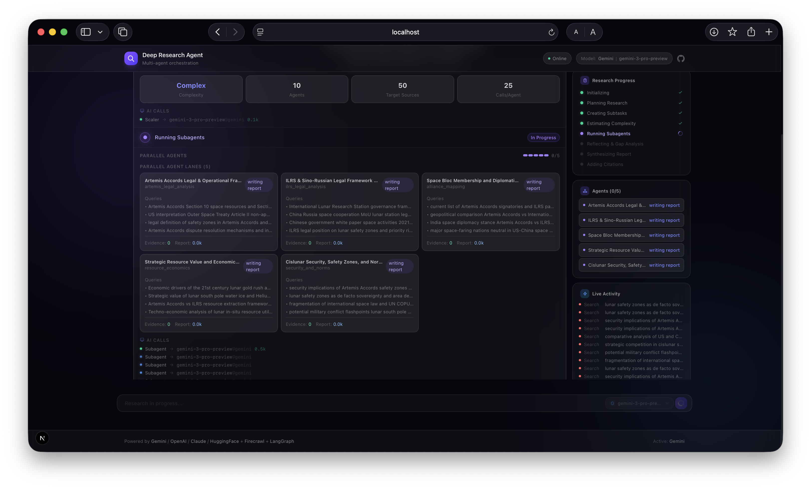
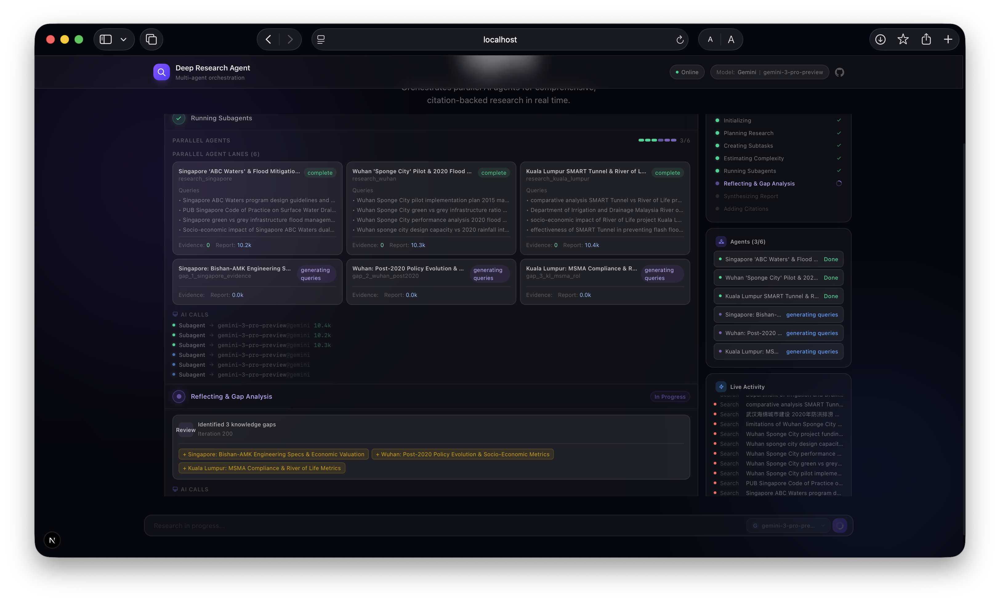
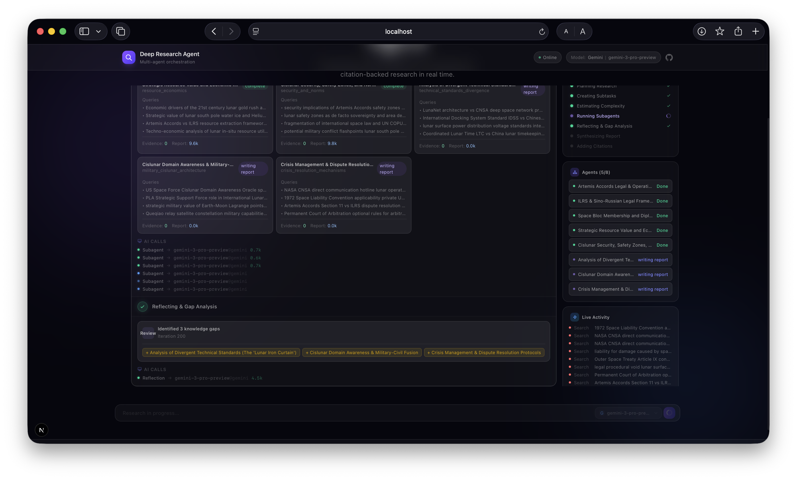
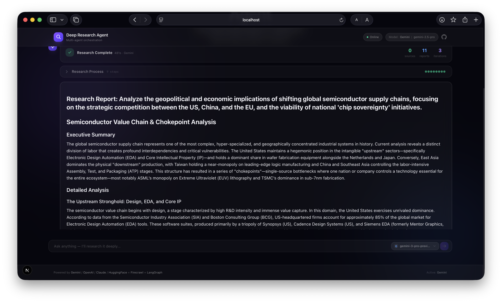
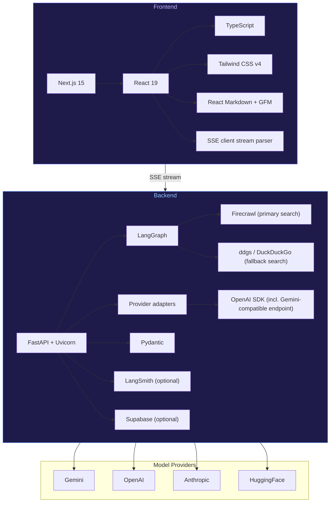

# Deep Research Agent

<p align="center">
  
</p>

A multi-agent, citation-aware research system that plans, delegates, reflects, and synthesizes high-quality reports in real time.

This project combines a FastAPI + LangGraph backend with a modern Next.js interface to deliver an end-to-end research workflow: from user query to structured, source-backed final report.

## Why this project

- Multi-agent orchestration: parallel subagents investigate different angles of the same problem.
- Reflection loop: the system audits its own coverage, detects gaps, and launches additional follow-up tasks when needed.
- Source-first workflow: Firecrawl web search with automatic DuckDuckGo fallback, source quality scoring, deduplication, and citation pass.
- Real-time observability: live progress phases, subagent lanes, LLM call telemetry, and source tracking in the UI.
- Multi-provider model routing: Gemini, OpenAI, Anthropic, and HuggingFace support with per-role overrides.
- Resilient search layer: Firecrawl is primary; if unavailable or failing, DuckDuckGo takes over transparently — zero config needed.

The result is a research assistant that is significantly more rigorous than a single-shot chat response and much better suited for deep, multi-step analysis.

---

## Core capabilities

### Deep Research algorithm 



### Deep Research in 10 quick steps

1. User sends a query to `POST /api/research/stream`.
2. Backend starts SSE and compiles the LangGraph state machine.
3. `plan` writes a research plan.
4. `split` creates independent subtasks.
5. `scale` sets subagent/tool/source budget.
6. `subagents` runs one agent per pending subtask in parallel.
7. Each subagent searches (Firecrawl → DuckDuckGo fallback), scores sources, refines queries (if weak), extracts evidence, writes a report.
8. `reflection` audits coverage and either adds gap subtasks or marks research complete.
9. If gaps exist, only new/pending subtasks run in the next wave.
10. `synthesize` merges reports, `cite` adds citations, SSE returns final result + completion stats.

### Why this implementation is different

- Iterative, not one-shot: reflection can add new subtasks to close missing coverage.
- Deep parallelism: parallel subagents plus parallel search/extract inside each subagent.
- Evidence quality controls: source scoring, domain diversity cap, and query refinement loop.
- Transparent runtime: phase/subagent events are streamed live to the UI over SSE.
- Flexible model routing: different roles can use different providers/models.
- Robust integrations: search/extract responses are normalized before downstream use.
- Resilient search: auto-falls back from Firecrawl to DuckDuckGo when unavailable or failing, so research never stops.
- Smart truncation detection: continues generation only when a report is genuinely cut off (dangling connective), avoiding false-positive retries.

### 1) End-to-end deep research pipeline

The backend executes an iterative LangGraph state machine with adaptive reflection that gives the agent the ability to:

- break broad questions into independent subtasks,
- run parallel evidence gathering,
- detect missing coverage,
- and only finalize after reflection criteria are met.

### 2) Parallel subagents with adaptive search

Each subagent:

- generates multiple search queries,
- runs web search (Firecrawl primary, DuckDuckGo fallback) and extraction,
- evaluates source quality,
- refines queries when quality is weak,
- writes a focused partial report with evidence.

### 3) Reflection and gap-filling

Instead of stopping after one pass, the reflection node reviews progress and can create new subtasks for unresolved areas. This improves completeness and reduces blind spots.

### 4) Citation-aware finalization

After synthesis, a dedicated citation pass aligns claims to known sources and produces a citation-enriched final report.

### 5) Professional live UI

The frontend is a full-featured research dashboard, not a simple chat box. It provides deep visibility into every stage of the research pipeline while keeping all critical information accessible at all times.

#### Three-column research dashboard

During active research, the UI uses a full-width three-column layout:

| Left sidebar (sticky) | Center | Right sidebar (sticky) |
|---|---|---|
| **Sources Gathered** — quality-scored list of all discovered sources, sorted by relevance, with domain tags and clickable links | **Phase Timeline** — live-updating step-by-step view of the current research phase with expandable detail panels | **Research Progress** — phase completion dots and current stage indicator |
| Stays visible while scrolling | Subagent parallel board, LLM call telemetry, reflection decisions | **Agent Status** — initial agents and gap-fill agents shown separately with live status per agent |
| Domain diversity breakdown | Scaling info, subtask list, plan preview | **Live Activity Feed** — real-time search and extraction events |

Both sidebars are **sticky** — they remain visible as the user scrolls through the center content, ensuring sources and agent progress are always one glance away.

#### Key UI features

- **Animated progress bar** — weighted by phase (`subagents` = 55%, `synthesize` = 12%, etc.) with elapsed timer and percentage.
- **Parallel subagent board** — grid of agent cards, each showing live queries, web searches with hit counts, quality-scored source bars, extraction status, evidence count, and report length.
- **Gap-fill agent separation** — agents launched during the initial wave and agents spawned by the reflection/gap-analysis loop are displayed in separate groups with distinct styling (violet for initial, amber for gap-fill).
- **Source quality bars** — every discovered source shows a color-coded quality bar (green ≥ 70%, amber ≥ 40%, red < 40%) so users can judge evidence strength at a glance.
- **Rolling AI topic suggestions** — the home screen generates and cycles through AI-suggested research topics with smooth roll-in/roll-out card animations.
- **Provider and model status** — header shows the active LLM provider, model name, and online/offline health indicator polling every 15 seconds.
- **Post-completion layout** — after research finishes, a completion banner shows total sources, reports, iterations, and time. The research process collapses into an expandable accordion, with sources and agents still accessible in the sidebars.
- **Glassmorphic dark theme** — backdrop blur, animated mesh gradient background, and subtle glow effects throughout.
- **Mobile responsive** — on smaller screens, sidebars collapse below the main content. Sources and agent panels are still accessible as stacked sections.
- **Markdown rendering** — final reports render with full Markdown support (headings, lists, code blocks, links) via React Markdown + GFM.

### 6) How multi-agents are assigned and tracked in progress

- Assignment unit: one subagent is spawned per pending subtask (`to_run = subtasks - completed_subtasks`).
- Iteration model: after each subagent wave, reflection can append new subtasks; next wave runs only new/pending items.
- Completion tracking: successful subagent returns mark `completed_subtasks`, increment `iteration_count`, and merge/dedupe sources.
- Progress % is weighted by phase in code: `init=2`, `plan=8`, `split=5`, `scale=5`, `subagents=55`, `reflection=5`, `synthesize=12`, `cite=8`.
- UI observability comes from SSE events emitted by backend (`subagents-launch`, `subagent-step`, `subagent-search`, `subagent-sources-scored`, `subagent-extract`, `subagent-complete`, `reflection`, `complete`).


### 7) LangChain/LangGraph usage (what is actually used)

- This project uses `langgraph` (LangChain ecosystem) as the orchestration engine via `StateGraph`.
- The graph is built in `backend/graph.py`, compiled at request time, and invoked with a typed `ResearchState`.
- Role-specific LLM calls are implemented through custom provider adapters (Gemini/OpenAI/Anthropic/HuggingFace), not LangChain agent executors.
- `langsmith.traceable` is used for node/function-level observability.

### 8) Parallelism model (how agents are spun up)

- Wave-level parallelism: each pending subtask is executed concurrently via `asyncio.to_thread(...)` in `run_subagents_parallel()`.
- Per-subagent search parallelism: each subagent runs query searches in a `ThreadPoolExecutor`.
- Per-subagent extract parallelism: each subagent runs URL extraction in another `ThreadPoolExecutor`.
- Net effect: nested parallelism (subtask concurrency + I/O concurrency inside each subtask).


### 9) Gap analysis & re-assignment loop (exact behavior)

- Reflection runs after every subagent wave.
- If `iteration_count >= max_iterations`, backend forces `research_complete = true` and emits `max-iterations-reached`.
- Otherwise reflection LLM audits existing subagent reports and returns JSON with `subtasks`.
- If returned `subtasks` is non-empty: they are appended to `state["subtasks"]`; `research_complete = false`; next loop runs only newly pending subtasks.
- If returned `subtasks` is empty: `research_complete = true` and pipeline proceeds to synthesis.


---

## Screenshots

Three-column research dashboard



Sources + agents visible while scrolling



Gap-fill agents after reflection



Final synthesized report



---

## Tech stack



---

## Project structure

```
deep_research_agent/
├── backend/                # FastAPI server, graph, agents, prompts
├── frontend/               # Next.js UI
├── assets/                 # Screenshots and media (you add files)
├── requirements.txt
├── run.py                  # Backend runner
├── .env.example

```

---

## Quick start

### 1) Clone and install

```bash
git clone <your-repo-url>
cd deep_research_agent

python -m venv .venv
source .venv/bin/activate
pip install -r requirements.txt

cd frontend
npm install
cd ..
```

### 2) Configure environment

Copy `.env.example` to `.env` and set at least:

```bash
LLM_PROVIDER=gemini
LLM_MODEL=gemini-2.5-pro
GEMINI_API_KEY=...
FIRECRAWL_API_KEY=...
```

Optional but recommended:

```bash
SUPABASE_URL=...
SUPABASE_SERVICE_KEY=...
LANGSMITH_API_KEY=...
MAX_ITERATIONS=3
QUALITY_THRESHOLD=0.7
```

### 3) Run backend

```bash
source .venv/bin/activate
python run.py
```

Backend default: `http://localhost:8000`

### 4) Run frontend

```bash
cd frontend
npm run dev
```

Frontend default: `http://localhost:3000`

---

## Configuration highlights

Global defaults:

- `LLM_PROVIDER`
- `LLM_MODEL`
- `MAX_ITERATIONS`
- `QUALITY_THRESHOLD`

Per-role model routing (examples):

- `PLANNER_PROVIDER`, `PLANNER_MODEL`
- `SUBAGENT_PROVIDER`, `SUBAGENT_MODEL`
- `COORDINATOR_PROVIDER`, `COORDINATOR_MODEL`
- `CITATION_PROVIDER`, `CITATION_MODEL`

This enables specialized model selection for planning, extraction reasoning, synthesis, and citation.

### External service setup (required vs optional)

| Service | Required | Environment variables | Purpose |
|---|---|---|---|
| LLM Provider (Gemini/OpenAI/Anthropic/HF) | Yes (at least one) | `LLM_PROVIDER`, `LLM_MODEL`, plus provider key (`GEMINI_API_KEY` or `OPENAI_API_KEY` or `ANTHROPIC_API_KEY` or `HF_TOKEN`) | All reasoning/planning/report generation |
| Firecrawl | Recommended | `FIRECRAWL_API_KEY` | Primary web search + extraction (auto-falls back to DuckDuckGo if unavailable or key is missing) |
| DuckDuckGo | Built-in | None (no key needed) | Free search fallback — activates automatically when Firecrawl is unavailable |
| Supabase | Optional | `SUPABASE_URL`, `SUPABASE_SERVICE_KEY` | Persist checkpoints/artifacts |
| LangSmith | Optional | `LANGSMITH_API_KEY`, `LANGCHAIN_TRACING_V2`, `LANGCHAIN_PROJECT` | Trace/observability |

Notes:
- If Firecrawl is unavailable or the key is missing, search transparently falls back to DuckDuckGo (free, no key). Extract calls return empty and subagents rely on search snippets as evidence.
- Supabase is best-effort persistence; pipeline still runs without it.

### Adding a new model under an existing provider

1. Quick usage (no code changes): set `LLM_MODEL=<provider-supported-model-id>` in `.env`.
2. Role-specific usage: set `<ROLE>_MODEL` (e.g., `SUBAGENT_MODEL=...`, `COORDINATOR_MODEL=...`).
3. Show model in frontend selector: add it to `AVAILABLE_MODELS` in `backend/config.py`.
4. Optional default update: add to `DEFAULT_MODELS` in `backend/config.py`.

### Adding an entirely new provider

1. Create provider adapter in `backend/providers/<new_provider>_provider.py` implementing `LLMProvider.chat(...)`.
2. Register it in `backend/providers/__init__.py` inside `get_provider()` and `list_providers()`.
3. Add provider models to `AVAILABLE_MODELS` and defaults to `DEFAULT_MODELS` in `backend/config.py`.
4. Add required API key env var in `.env.example`.
5. (Optional) set role-level overrides to route specific stages to the new provider.

---

## API overview

Key endpoints:

- `POST /api/research/stream` — starts a streaming research run (SSE)
- `POST /api/research` — starts a run and returns run_id
- `GET /api/research/{run_id}/stream` — stream by run id
- `GET /api/config` — provider/model configuration
- `GET /api/health` — backend health status
- `POST /api/topics/suggestions` — AI-generated topic cards for UI suggestions

---

## What this agent can do

**Research capabilities:**

- Turn broad, complex prompts into structured research plans.
- Investigate multiple perspectives in parallel via independent subagents.
- Gather and evaluate web evidence with quality-aware filtering and domain diversity controls.
- Detect missing information through reflection and perform follow-up research autonomously.
- Produce long-form, reasoned reports with a dedicated citation stage.

**Real-time observability:**

- Stream transparent progress so users can inspect the full reasoning workflow as it happens.
- Show every source gathered (with quality score), every search executed, and every agent's status in real time.
- Separate initial research agents from gap-fill agents spawned by reflection, so the user always knows why each agent was created.
- Keep sources and agent progress visible at all times via sticky sidebars — nothing disappears on scroll.
- Display provider health, model selection, and elapsed research time in the header.

---

## Notes

- This system depends on external model and search APIs; output quality depends on provider health, credentials, and source availability.
- For best results, use clear research prompts with scope, time range, and target domain.

---

## References

- Anthropic Engineering: Multi-agent research system (conceptual inspiration)
    - https://www.anthropic.com/engineering/multi-agent-research-system


