# Deep Research Agent

<p align="center">
  
</p>

A multi-agent, citation-aware research system that plans, delegates, reflects, and synthesizes high-quality reports in real time.

This project combines a FastAPI + LangGraph backend with a modern Next.js interface to deliver an end-to-end research workflow: from user query to structured, source-backed final report.

## Why this project

- Multi-agent orchestration: parallel subagents investigate different angles of the same problem.
- Reflection loop: the system audits its own coverage, detects gaps, and launches additional follow-up tasks when needed.
- Source-first workflow: Firecrawl-powered web search and extraction with source quality scoring, deduplication, and citation pass.
- Real-time observability: live progress phases, subagent lanes, LLM call telemetry, and source tracking in the UI.
- Multi-provider model routing: Gemini, OpenAI, Anthropic, and HuggingFace support with per-role overrides.

The result is a research assistant that is significantly more rigorous than a single-shot chat response and much better suited for deep, multi-step analysis.

---

## Core capabilities

### Architecture

```mermaid
flowchart LR
    A["🔍 User Query"] --> B["📋 Plan"]
    B --> C["✂️ Split"]
    C --> D["📐 Scale"]
    D --> E["🤖 Subagents"]
    E --> F{"🔄 Reflect"}
    F -- "gaps found" --> E
    F -- "complete" --> G["📝 Synthesize"]
    G --> H["📎 Cite"]
    H --> I["✅ Final Report"]

    style A fill:#7c3aed,color:#fff,stroke:none
    style E fill:#2563eb,color:#fff,stroke:none
    style F fill:#f59e0b,color:#000,stroke:none
    style I fill:#10b981,color:#fff,stroke:none
```



### Subagent pipeline


### 1) End-to-end deep research pipeline

The backend executes an iterative graph with adaptive reflection that gives the agent the ability to:

- break broad questions into independent subtasks,
- run parallel evidence gathering,
- detect missing coverage,
- and only finalize after reflection criteria are met.

### 2) Parallel subagents with adaptive search

Each subagent:

- generates multiple search queries,
- runs web search and extraction,
- evaluates source quality,
- refines queries when quality is weak,
- writes a focused partial report with evidence.

### 3) Reflection and gap-filling

Instead of stopping after one pass, the reflection node reviews progress and can create new subtasks for unresolved areas. This improves completeness and reduces blind spots.

### 4) Citation-aware finalization

After synthesis, a dedicated citation pass aligns claims to known sources and produces a citation-enriched final report.

### 5) Professional live UI

Frontend includes:

- real-time research progress,
- phase timeline,
- parallel subagent board,
- source panels and activity feeds,
- rolling AI-generated topic suggestions,
- provider/model status and selection.

---

## Screenshots

| Research in progress | Parallel subagent lanes |
|:---:|:---:|
|  |  |

| Reflection & gap analysis | Final synthesized report |
|:---:|:---:|
|  |  |

---

## Tech stack


---

## Project structure

```
deep_research_agent/
├── backend/                # FastAPI server, graph, agents, prompts
├── frontend/               # Next.js UI
├── assets/                 # Screenshots and media (you add files)
├── requirements.txt
├── run.py                  # Backend runner
├── .env.example

```

---

## Quick start

### 1) Clone and install

```bash
git clone <your-repo-url>
cd deep_research_agent

python -m venv .venv
source .venv/bin/activate
pip install -r requirements.txt

cd frontend
npm install
cd ..
```

### 2) Configure environment

Copy `.env.example` to `.env` and set at least:

```bash
LLM_PROVIDER=gemini
LLM_MODEL=gemini-2.5-pro
GEMINI_API_KEY=...
FIRECRAWL_API_KEY=...
```

Optional but recommended:

```bash
SUPABASE_URL=...
SUPABASE_SERVICE_KEY=...
LANGSMITH_API_KEY=...
MAX_ITERATIONS=3
QUALITY_THRESHOLD=0.7
```

### 3) Run backend

```bash
source .venv/bin/activate
python run.py
```

Backend default: `http://localhost:8000`

### 4) Run frontend

```bash
cd frontend
npm run dev
```

Frontend default: `http://localhost:3000`

---

## Configuration highlights

Global defaults:

- `LLM_PROVIDER`
- `LLM_MODEL`
- `MAX_ITERATIONS`
- `QUALITY_THRESHOLD`

Per-role model routing (examples):

- `PLANNER_PROVIDER`, `PLANNER_MODEL`
- `SUBAGENT_PROVIDER`, `SUBAGENT_MODEL`
- `COORDINATOR_PROVIDER`, `COORDINATOR_MODEL`
- `CITATION_PROVIDER`, `CITATION_MODEL`

This enables specialized model selection for planning, extraction reasoning, synthesis, and citation.

---

## API overview

Key endpoints:

- `POST /api/research/stream` — starts a streaming research run (SSE)
- `POST /api/research` — starts a run and returns run_id
- `GET /api/research/{run_id}/stream` — stream by run id
- `GET /api/config` — provider/model configuration
- `GET /api/health` — backend health status
- `POST /api/topics/suggestions` — AI-generated topic cards for UI suggestions

---

## What this agent can do

- Turn broad, complex prompts into structured research plans.
- Investigate multiple perspectives in parallel.
- Gather and evaluate web evidence with quality-aware filtering.
- Detect missing information and perform follow-up research autonomously.
- Produce long-form, reasoned reports with a citation stage.
- Stream transparent progress so users can inspect the full reasoning workflow.

---

## Notes

- This system depends on external model and search APIs; output quality depends on provider health, credentials, and source availability.
- For best results, use clear research prompts with scope, time range, and target domain.

---


